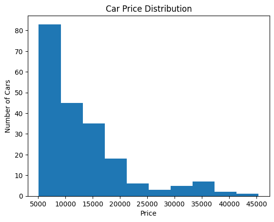
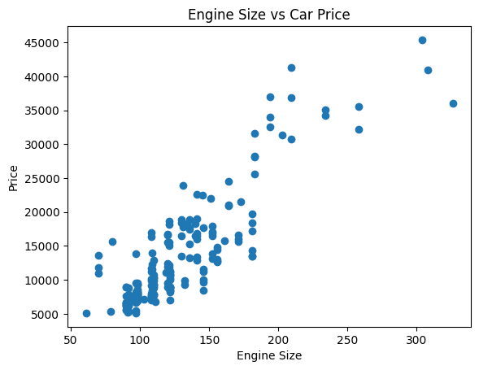
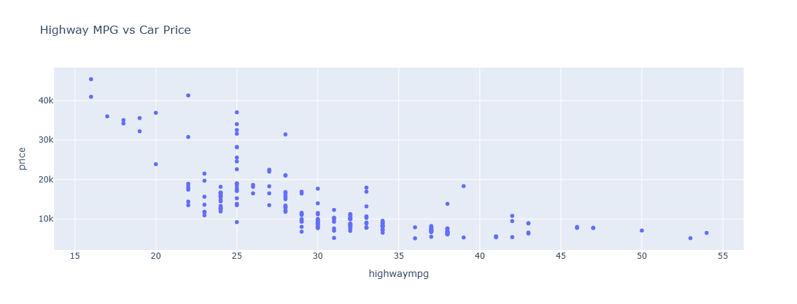

# Car Price Analysis Project 1

# Car Price Analysis 
Car Price Analysis is a project based on car pricing in the US market. It focuses on understanding the different factors that can influence the price of a car and why prices vary between different vehicles.

The data set was acquired from Car Price Prediction – Multiple Linear Regression from Kaggle.

# 

## Dataset Content
The dataset has 205 rows and 26 columns, with a file size of 27 KB. Each row represents one car, and each column describes a specific feature.

The information covers a wide range of attributes, including car make and model, fuel type, engine specifications, vehicle dimensions, performance indicators and the final selling price.

This dataset will be used to explore how these features vary and how strongly they relate to price.

## Business Requirements

# The automobile company needs the analysis to:

* Understand how car prices vary across the US market.
* Identify which car features have the strongest relationship with price.
* Explore whether features such as engine size, horsepower, body style and fuel efficiency affect car prices.
* Compare prices between different types and makes of cars.
* Use the findings to support decisions about vehicle design, pricing and market strategy

## Hypothesis and how to validate?
Hypothesis: The larger the engine size, the more expensive the car.

How it will be validated:

* Note the relationship between engine size and price  
* Visualizations to show any patterns/trends.  
* Calculate the correlation between engine size and price. This measures the strength of the relationship.  
* Check the results to see if the data support the hypothesis.

The hypothesis is supported by the analysis.  

## Conclusion

The analysis meets the business requirements by providing a clearer understanding of the factors associated with car prices in the dataset.

### Car Price Distribution

Most cars are concentrated within the lower price ranges, while fewer vehicles have much higher prices.

### Engine Size and Car Price

Engine size shows a strong positive relationship with price. Cars with larger engines generally have higher prices, supporting the project hypothesis.

### Highway MPG and Car Price

Highway MPG shows a different relationship with price. Cars with higher highway fuel efficiency generally appear within the lower price ranges.

Overall, the findings show that vehicle characteristics such as engine size, horsepower and fuel efficiency are associated with differences in car price. These findings can support decisions around vehicle design, pricing and market strategy

## Project Plan
1. Load and understand the dataset -Set up the GitHub repository to organise the project and track progress.   
1.1. Download the CarPrice_Assignment.csv dataset from Kaggle and add it to the project.  
1.2. Import the Python libraries needed for the analysis.  
1.3. Load the dataset into a Pandas DataFrame.  
1.4. View the first rows and check the number of rows and columns.  
1.5. Examine the column names, data types and the type of information held in each column.  
2. Check and clean the data.  
2.1. Check the dataset for missing values and duplicated rows.  
2.2. Look for spelling differences or inconsistent values within the categorical columns.  
2.3. Decide whether any columns are unnecessary for the analysis.  
2.4. Make any required corrections so the data is ready to use.  
2.5. Confirm the dataset’s shape after cleaning to check whether any rows or columns were removed.  
3. Explore the data using descriptive statistics.
3.1. Calculate summary statistics for the numerical columns.  
3.2. Examine the minimum, maximum, mean and median car prices.  
3.3. Compare values across features such as engine size, horsepower and fuel efficiency.  
3.4. Review the different categories found in columns such as car body, fuel type and drive wheel.  
3.5. Use the results to identify noticeable patterns or unusual values.  
4. Investigate relationships and create visualisations.  
4.1. Explore how individual car features relate to price.  
4.2. Calculate correlations between numerical variables.  
4.3. Create suitable charts to make patterns and relationships easier to understand.  
4.4. Compare prices across different vehicle categories.  
4.5. Use the visualisations to identify which features appear to have the strongest relationship with car price.  
5. Review the results and form a conclusion.  
5.1. Compare the findings with the project hypothesis.  
5.2. Decide whether the results support or reject the hypothesis.  
5.3. Summarise the most important patterns found during the analysis.  
5.4. Explain which car features appear to have the greatest influence on price.  
5.5. Present the final conclusion clearly for both technical and non-technical readers.
6. Relate the findings to the business requirements.  
6.1. Use the visualisations to explain how car prices are distributed.  
6.2. Identify which car features show the strongest relationships with price.  
6.3. Use the engine size and price relationship to support the hypothesis.  
6.4. Summarise how the findings could support pricing and vehicle design decisions.

## Rationale to map the business requirements to the data visualisations

- Car price distribution is visualised to show the range of prices in the dataset and identify where most car prices are concentrated.
- Relationships between car features and price are visualised to identify which features appear to have the strongest influence on price.
- Engine size and car price are compared visually to support the project hypothesis that cars with larger engines tend to have higher prices.
- Comparisons between different vehicle categories help show how factors such as drive wheel, fuel type and aspiration relate to car price.
- Different visualisation types are used to make the findings clear and easier to understand for both technical and non-technical readers.

## Analysis techniques used

- The dataset is first examined to understand its structure, including the number of rows and columns, column names, data types and unique values.
- Data quality checks are carried out to identify missing values, duplicated rows and inconsistent entries before beginning the analysis.
- Descriptive statistics are used to examine values such as the mean, median, minimum and maximum and to understand how numerical features vary across the dataset.
- Correlation analysis is used to identify which numerical features have the strongest relationships with car price and to support the project hypothesis.
- Matplotlib, Seaborn and Plotly visualisations are used to explore patterns, distributions and relationships within the data.
- The analysis follows a logical order, beginning with data extraction and cleaning, followed by exploration, visualisation and interpretation of the results.
- One limitation is the dataset size, as it contains only 205 cars and may not fully represent the wider US car market. Correlation can show relationships between variables, but it cannot prove that one variable directly causes changes in another.
- Generative AI supports project planning, README structure, code adjustments and the selection of suitable analysis and visualisation methods. Suggested content and code are reviewed, tested and adjusted before being included in the project.

## Ethical considerations (optional)

I handled the data responsibly and followed the UK GDPR and Data Protection Act 2018 to ensure that any personal or sensitive information was protected.

## Unfixed Bugs

No known unfixed bugs remain in the project.

## Development Roadmap

During the project, some challenges were encountered with data cleaning, selecting suitable visualisations and displaying Plotly charts correctly within the Jupyter Notebook. These were resolved by checking the data carefully, testing the code and making adjustments where needed.

The project helped develop skills in data extraction, data cleaning, exploratory data analysis and data visualisation using Matplotlib, Seaborn and Plotly. It also provided further experience with Jupyter Notebooks, Git, GitHub and organising a complete data analysis project.

For future projects, these skills can be developed further by working with larger datasets, exploring more advanced statistical analysis and creating interactive dashboards.

## Main Data Analysis Libraries

- **Pandas** - used to load, inspect, clean and analyse the dataset.
- **NumPy** - used to support numerical data analysis.
- **Matplotlib** - used to create visualisations showing distributions and relationships within the data.
- **Seaborn** - used to create statistical visualisations and explore relationships between variables.
- **Plotly Express** - used to create interactive visualisations for exploring the car price data.

## Credits

- Code Institute LMS learning materials and personal notes made throughout the course were used as the main reference for the techniques and code applied in this project.
- *Python Crash Course, Third Edition* by Eric Matthes was used as an additional reference for Python concepts and programming.
- ChatGPT was used throughout the project for structural guidance, help with wording and organising the README and Jupyter Notebooks, and support when troubleshooting errors.
- ChatGPT was also used on occasions to assist with adapting or correcting code. Any suggested code was reviewed, tested and adjusted before being included in the project.
- The project structure, analysis decisions, visualisation choices and interpretation of the results were developed and reviewed as part of the project work

## Acknowledgements

A special thank you to the Code Institute tutors and learning community for the guidance and support provided throughout the course.

Thanks also to my family for their patience and support while completing the course and this project.
